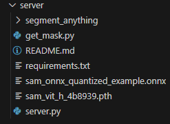

# Python server

## Installation instructions

Nvidia GPU and Python version 3.8 or higher is required for segment anything (3.11 recommended for this app). Please install [Anaconda](https://www.anaconda.com/download) and [CUDA Toolkit](https://developer.nvidia.com/cuda-11-8-0-download-archive) too.


### Downloading the model checkpoint.

Download the model checkpoint from the [official segment anything repository](https://github.com/facebookresearch/segment-anything#model-checkpoints). Select the ViT-H SAM Model and put the downloaded sam_vit_h_4b8939.pth file in the server folder. The server folder should look like this when all the necessary files are there:



### Packages
please install the following packages (Using Anaconda prompt is recommended)

```
pip install git+https://github.com/facebookresearch/segment-anything.git
```

Inside `FashionFinder/server/` folder, install packages from requirements.txt

```
pip install -r requirements.txt
```

Install pytorch with CUDA support, torchvision and torch audio

```
conda install pytorch==2.0.1 torchvision==0.15.2 torchaudio==2.0.2 pytorch-cuda=11.8 -c pytorch -c nvidia
```

Start the server

```
Python server.py
```

### Segment Anything

for more information about Segment Anything, please checkout their [github repository](https://github.com/facebookresearch/segment-anything) and [official site](https://segment-anything.com/)